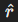

# Матчасть

Для моделирования движения материальной точки на двумерной плоскости удобно использовать декартову систему координат (x, y). Положение в каждый момент времени задается координатами (x(t), y(t)), где t - время.

1. Положение и движение:

   * Положение точки: (x, y) - координаты.
   * Скорость: (Vx, Vy), где Vx = dx/dt, Vy = dy/dt.
   * Ускорение: (ax, ay), где ax = dVx/dt, ay = dVy/dt.
2. Основные законы движения:

   1. Первый закон Ньютона (закон инерции):
      Если на точку не действуют внешние силы или их сумма равна нулю, она либо покоится, либо движется равномерно
      и прямолинейно: Fрез = 0 ⟹ V = const.
   2. Второй закон Ньютона: Ускорение точки пропорционально результирующей силе, действующей на нее, и обратно пропорционально массе: 
   3. Третий закон Ньютона: Силы взаимодействия двух тел равны по модулю и противоположны по направлению.

# Уравнения движения

1. При постоянном ускорении:

   

Здесь x0, y0 - начальные координаты. Vx0, Vy0 - начальные компоненты скорости.

2. Если ускорение изменяется со временем:

и аналогично для y(t).

# Силы действующие на точку

Для вычисления ускорения точки необходимо учитывать силы:

* Сила тяжести:  
* Сила сопротивления среды  где k - коэффициент сопротивления среды.
* Центростремительная сила (при движении по окружности):  где r - радиус,   - единичный вектор направления.
